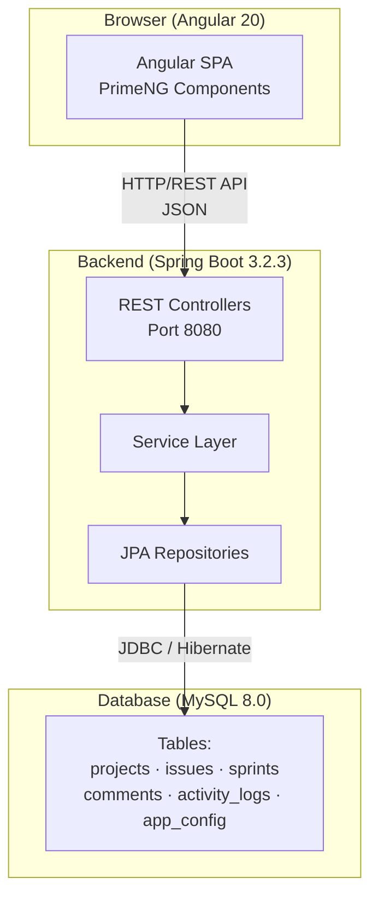
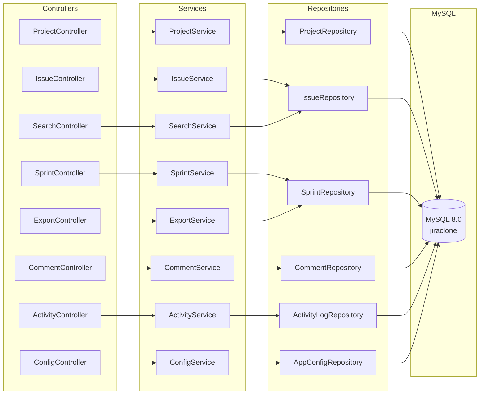
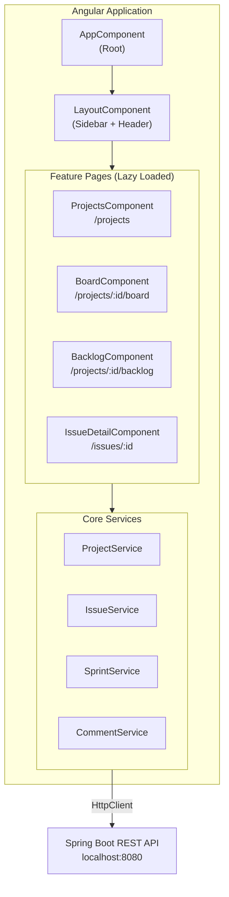
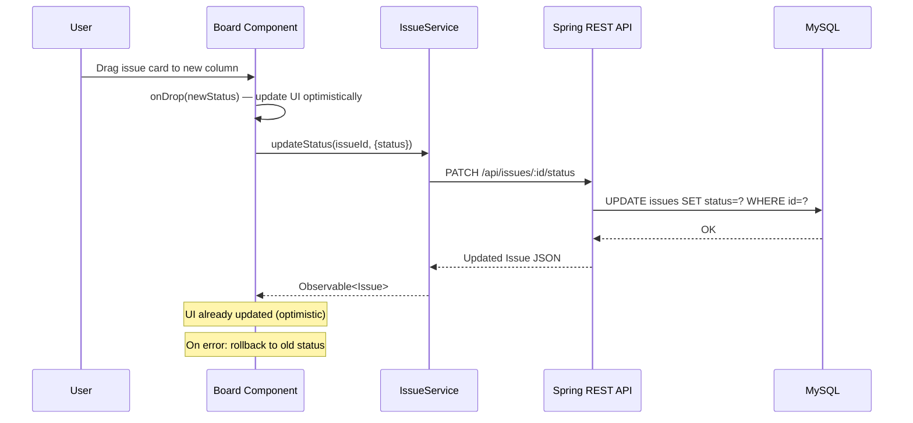
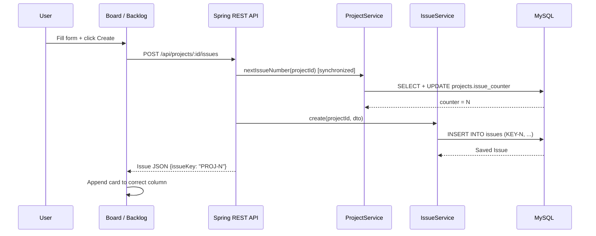
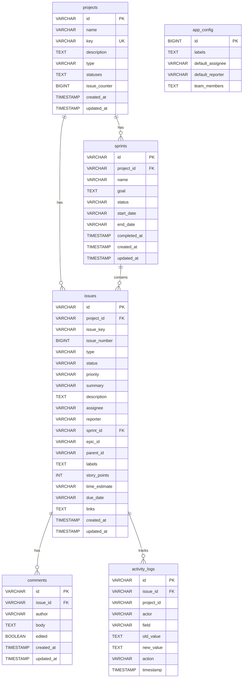

# JIRA Clone

A full-stack project management application inspired by Atlassian JIRA, built with **Spring Boot + MySQL** on the backend and **Angular 20 + PrimeNG** on the frontend.

---

## Table of Contents

- [Features](#features)
- [Tech Stack](#tech-stack)
- [Architecture Overview](#architecture-overview)
- [Getting Started](#getting-started)
- [API Reference](#api-reference)
- [Database Schema](#database-schema)

---

## Features

| Feature | Description |
|---|---|
| Projects | Create and manage Scrum/Kanban projects |
| Kanban Board | Drag & drop issues across status columns |
| Backlog | Sprint planning with issue assignment |
| Sprint Management | Create, start, and complete sprints |
| Issue Tracking | Full CRUD with type, priority, assignee, labels |
| Comments | Threaded comments on issues |
| Activity Log | Audit trail of all issue changes |
| Export | Export issue list to Excel |
| Search | Filter issues by type, status, priority, assignee |

---

## Tech Stack

### Backend
- **Java 17** + **Spring Boot 3.2.3**
- **Spring Data JPA** + **Hibernate**
- **MySQL 8.0**
- **Apache POI** (Excel export)
- **Lombok**

### Frontend
- **Angular 20** (Standalone components)
- **PrimeNG 20** (UI component library, Aura theme)
- **TypeScript 5.8**

---

## Architecture Overview

### High-Level System Architecture



### Backend Layer Architecture



### Frontend Architecture



### Data Flow — Issue Status Update (Drag & Drop)



### Data Flow — Create Issue



---

## Getting Started

### Prerequisites

- Java 17+
- Maven 3.8+
- Node.js 20+
- MySQL 8.0 running locally

### 1. Start the Backend

```bash
cd jira-clone-backend

# MySQL must be running — the DB is auto-created
mvn spring-boot:run
```

Backend runs on **http://localhost:8080**
Tables are auto-created by Hibernate (`ddl-auto=update`)

### 2. Start the Frontend

```bash
cd jira-clone-frontend
npm install
npm start
```

Frontend runs on **http://localhost:4200**

---

## API Reference

Base URL: `http://localhost:8080/api`

### Projects

| Method | Endpoint | Description |
|---|---|---|
| GET | `/projects` | List all projects |
| POST | `/projects` | Create project |
| GET | `/projects/:id` | Get project |
| PUT | `/projects/:id` | Update project |
| DELETE | `/projects/:id` | Delete project |
| GET | `/projects/:id/issues` | Issues in project |
| GET | `/projects/:id/sprints` | Sprints in project |

### Issues

| Method | Endpoint | Description |
|---|---|---|
| GET | `/issues/:id` | Get issue |
| PUT | `/issues/:id` | Update issue |
| DELETE | `/issues/:id` | Delete issue |
| PATCH | `/issues/:id/status` | Update status |
| PATCH | `/issues/:id/sprint` | Assign to sprint |
| GET | `/issues/:id/comments` | Get comments |
| POST | `/issues/:id/comments` | Add comment |
| GET | `/issues/:id/activity` | Activity log |

### Sprints

| Method | Endpoint | Description |
|---|---|---|
| POST | `/projects/:id/sprints` | Create sprint |
| PUT | `/sprints/:id` | Update sprint |
| POST | `/sprints/:id/start` | Start sprint |
| POST | `/sprints/:id/complete` | Complete sprint |
| DELETE | `/sprints/:id` | Delete sprint |

### Search & Export

| Method | Endpoint | Description |
|---|---|---|
| POST | `/search` | Search issues with filters |
| POST | `/export/excel` | Export to Excel |

---

## Database Schema


