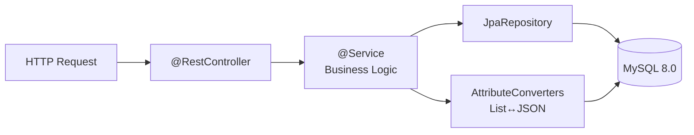
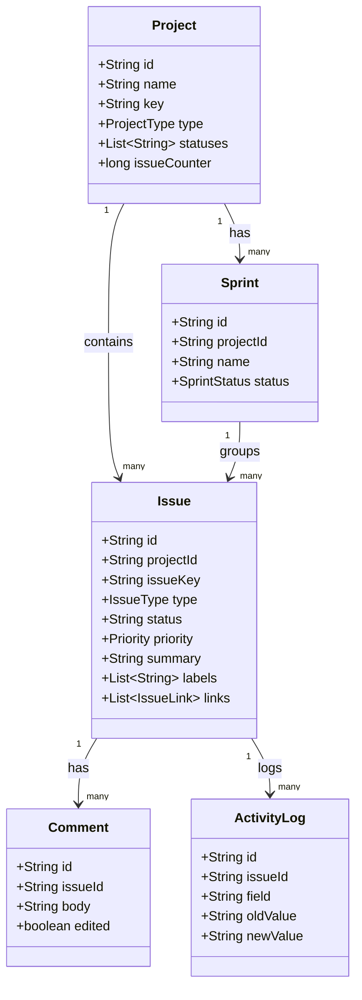

# JIRA Clone — Backend

Spring Boot 3.2.3 REST API with MySQL persistence.

## Quick Start

```bash
# Requires: Java 17+, Maven 3.8+, MySQL 8.0 running

mvn spring-boot:run
# API available at http://localhost:8080/api
```

## Configuration

`src/main/resources/application.properties`

```properties
spring.datasource.url=jdbc:mysql://localhost:3306/jiraclone?createDatabaseIfNotExist=true
spring.datasource.username=root
spring.datasource.password=<your-password>
spring.jpa.hibernate.ddl-auto=update   # auto-creates/updates tables
```

## Package Structure

```
com.jiraclone/
├── config/           # CORS, global exception handler
├── controller/       # REST endpoints
│   ├── ProjectController
│   ├── IssueController
│   ├── SprintController
│   ├── CommentController
│   ├── ActivityController
│   ├── SearchController
│   ├── ExportController
│   └── ConfigController
├── service/          # Business logic
├── repository/       # Spring Data JPA repositories
├── model/            # JPA entities
│   ├── Project
│   ├── Issue
│   ├── Sprint
│   ├── Comment
│   ├── ActivityLog
│   ├── AppConfig
│   └── IssueLink     (POJO — serialized as JSON)
├── dto/              # Request/Response DTOs
├── converter/        # JPA AttributeConverters (JSON lists)
└── model/enums/      # IssueType, Priority, SprintStatus, etc.
```

## Architecture



## Entity Relationships



## API Endpoints

### Projects `GET /api/projects`

```json
[
  {
    "id": "uuid",
    "name": "My Project",
    "key": "PROJ",
    "type": "SCRUM",
    "statuses": ["To Do", "In Progress", "In Review", "Done"],
    "issueCounter": 5
  }
]
```

### Create Issue `POST /api/projects/:id/issues`

```json
{
  "type": "TASK",
  "summary": "Fix login bug",
  "priority": "HIGH",
  "assignee": "alice",
  "storyPoints": 3
}
```

## Build

```bash
mvn compile          # compile only
mvn package          # build JAR
mvn spring-boot:run  # run dev server
```
