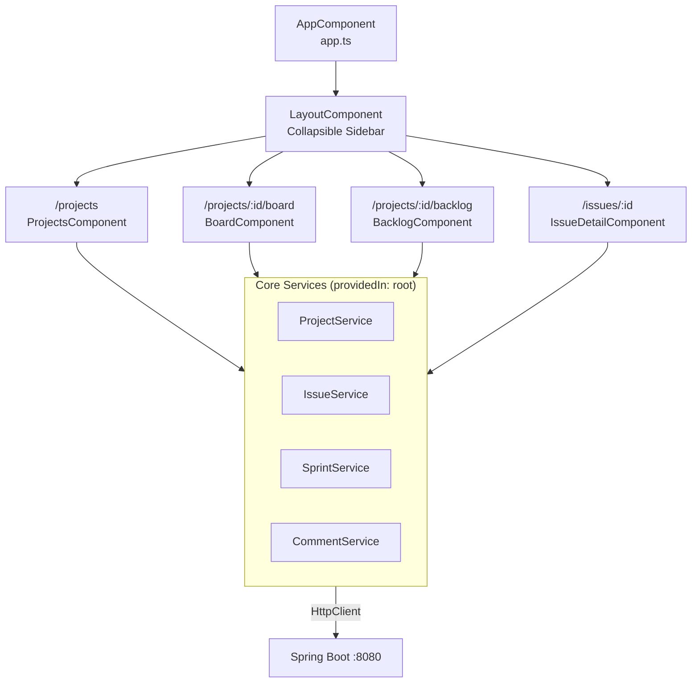
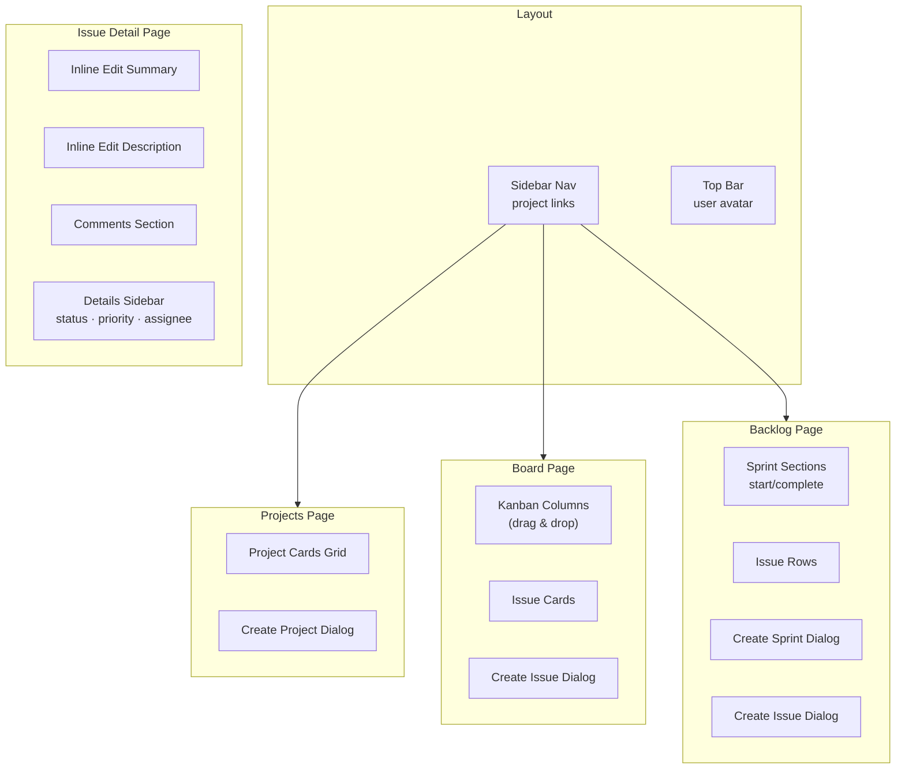
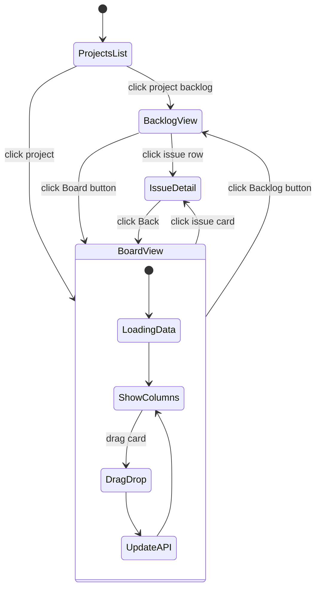

# JIRA Clone — Frontend

Angular 20 SPA with PrimeNG 20 (Aura theme), consuming the Spring Boot REST API.

## Quick Start

```bash
npm install
npm start          # dev server at http://localhost:4200
npm run build      # production build
```

## App Structure



## Routing

| Path | Component | Description |
|---|---|---|
| `/` | redirect | → `/projects` |
| `/projects` | ProjectsComponent | Project cards grid |
| `/projects/:id/board` | BoardComponent | Kanban board |
| `/projects/:id/backlog` | BacklogComponent | Sprint + backlog |
| `/issues/:id` | IssueDetailComponent | Issue detail/edit |

## Component Map



## PrimeNG Components Used

| PrimeNG | Usage |
|---|---|
| `p-button` | All action buttons |
| `p-dialog` | Create forms (project, issue, sprint) |
| `p-select` | Dropdowns (type, priority, status) |
| `p-inputtext` | Text inputs |
| `p-textarea` | Description / comment fields |
| `p-toast` | Success/error notifications |
| `p-tag` | Status badges |
| `p-progressspinner` | Loading indicators |
| `p-avatar` | User avatars |
| `p-divider` | Section separators |
| `p-accordion` | Collapsible sprint sections |

## State Flow



## Environment Config

`src/environments/environment.ts`

```typescript
export const environment = {
  production: false,
  apiUrl: 'http://localhost:8080/api'
};
```

## Scripts

```bash
npm start          # ng serve (dev, port 4200)
npm run build      # ng build (production)
npm test           # ng test (karma)
```
